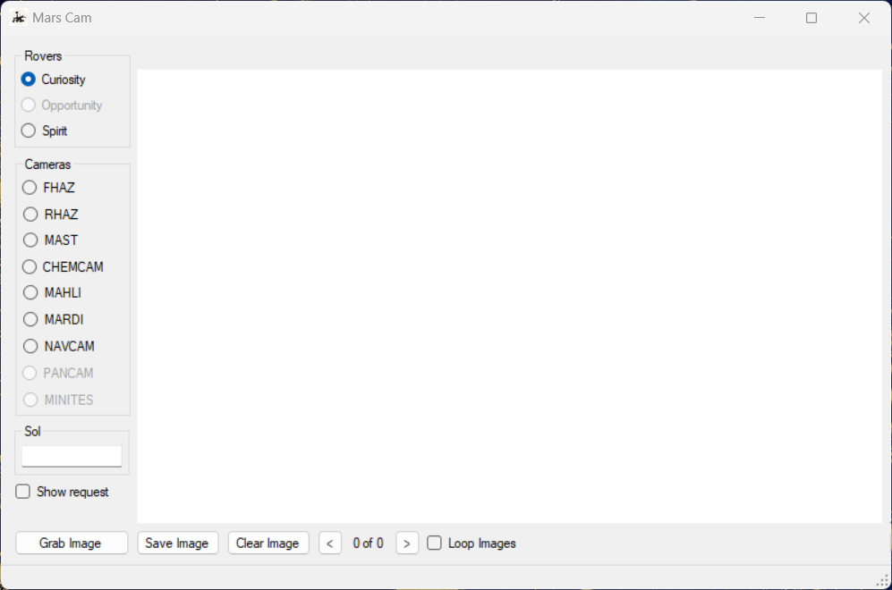
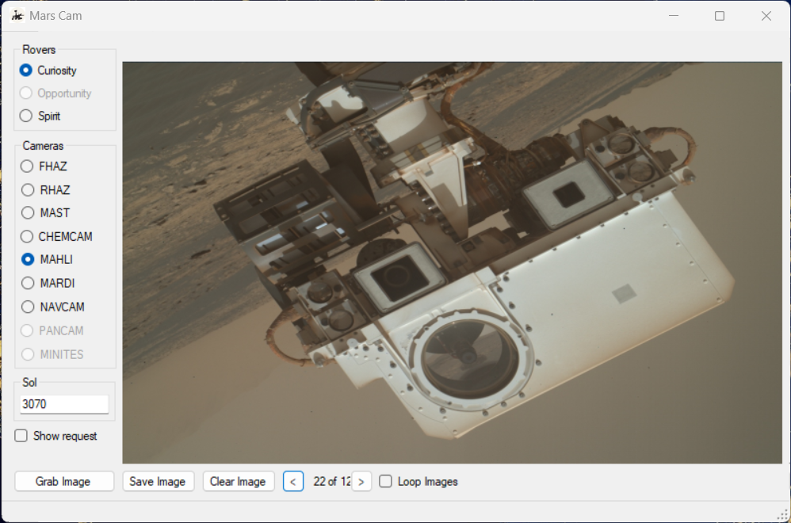
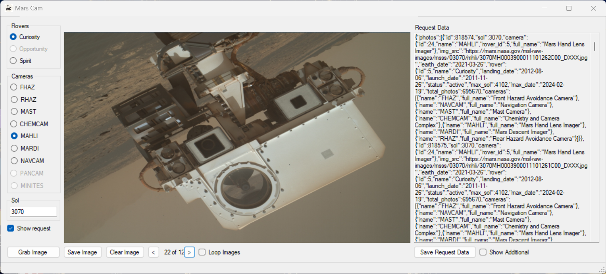
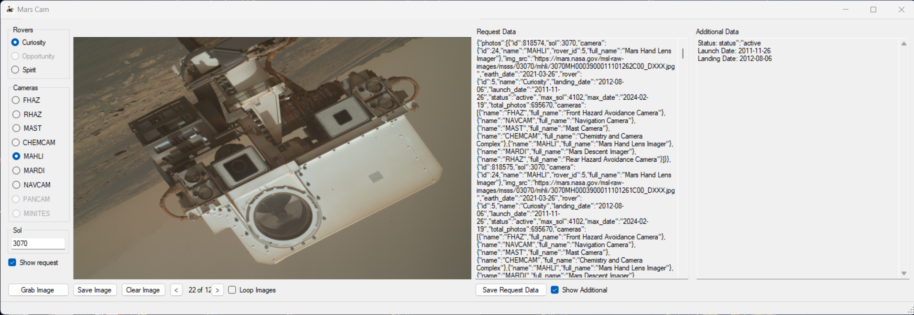

<h1 align="center" id="title">Mars Cam</h1>

View and save the images taken by NASA Mars Rovers. Just select your rover your camera and your solar day (sol).

<h2>🚀 Demo</h2>
Coming soon.

<h2>Project Screenshots:</h2>

  
  
<h2>🧐 Features</h2>

Here're some of the project's best features:

*   You can select multiple mars rovers to view
*   You can select any camera on any rover
*   If there are multiple images for the sol that you choose you can have the app automatically loop through the images for easy viewing
*   Save images
*   Save request output

<h2>🍰 Contribution Guidelines:</h2>

Coming in the near future.

  
  
<h2>💻 Built with</h2>

Technologies used in the project:

*   Visual Basic (.NET Framework)

<h2>💖Like my work?</h2>

If you like my work and would like to support me I am flattered. However I don't accept donations - because... reasons? I suppose!. IF you really want to give some money as appreciation for my work please consider donating to Autism Rocks Fife (Charity Number: SC 045130 (SCIO)). They have helped me to become the person I am today and I will be forever grateful of the work that they do.
https://www.justgiving.com/campaign/autism-rocks-fife?utm_medium=campaign&amp;utm_content=campaign%2Fautism-rocks-fife&amp;utm_source=copyLink&amp;utm_campaign=005

